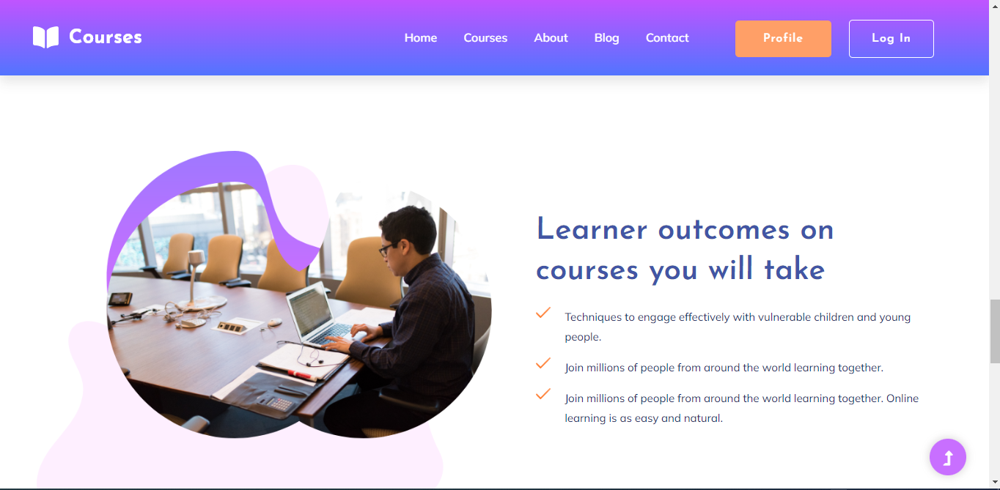

## Oneline Course project

### Actually throw this project 

- [x] Student can buy any course which his need
- [x] Student find own personal profile where all documet is included
- [x] Any Student Can Study
- [x] Student can contact to his course teacher
- [x] Student find easily  level book

### And 

- [x] An admin easily set up his profile
- [x] An admin easily set up course related data
- [x] An admin easily control his student  

### Here 
  

__This is Home Page in Online Course Project for the users.__  

__And also__     
   
      
   
    

The above picture were from a student or user

__Now let's go to the site of an admin or a controller__  

      
   
      
  
      
   
      
   

